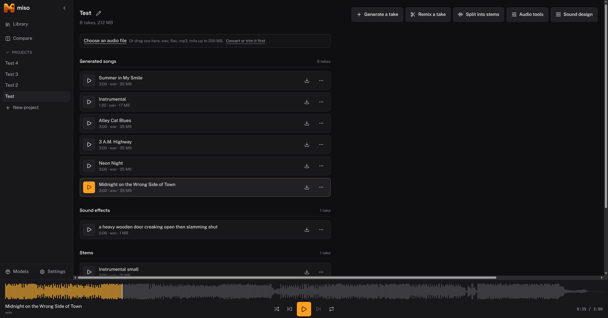
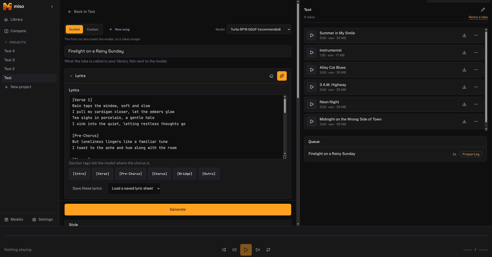
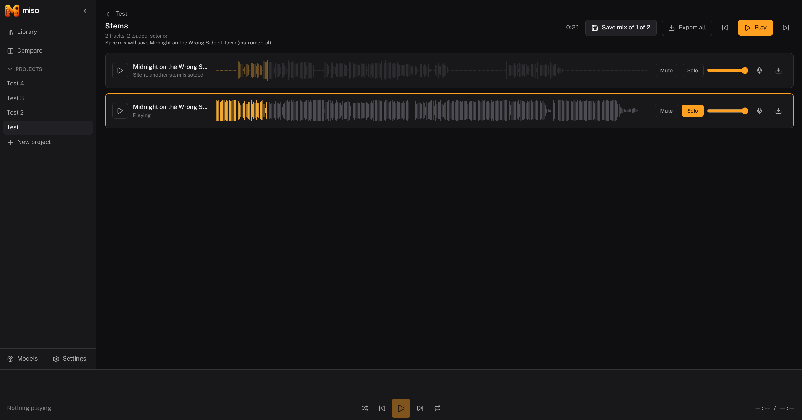

<p align="center">
  
</p>

# Miso

A local music generation and remix studio. You bring a prompt or a song, and Miso gives you
a real workspace for generating, remixing, splitting, and finishing music with models that
run on your own machine. Nothing is sent anywhere.

Miso runs on [audio.cpp](https://github.com/0xShug0/audio.cpp), a C++ inference runtime for
audio models. Miso is the studio around it: projects that persist, a history of every take,
and a record of exactly how each clip was made so you can change one thing and try again.


<p align="center">
  
</p>

This is the first public release. Miso installs models, keeps your projects and audio, generates with ACE-Step from a guided prompt builder with lyrics written for you if you want them, repaints a section of a track, covers a take, holds any two takes against each other, splits a song into stems you can mix and export, sings a vocal stem again in one of four packaged voices or in the voice of any other track you have, sings written lyrics in a voice you pick with a melody of your own or one it writes, transcribes a take to MIDI, makes sound effects, and converts, trims, fades and levels audio in the browser without touching a model.

I have run this on one machine, a laptop with a 16 GB RTX 4090. Other cards and other drivers are untested, so if something breaks on yours I would like to hear about it.

## Why I made this

There are other interfaces for audio.cpp, including one built into the server itself. They
are all one-shot: fill in a form, get a file, lose it when you close the tab. None of them
goes deep on music.

Miso is project-shaped instead. It keeps your work, tracks how each clip came to be, and
lets you feed one result into the next step. The feature it is built around is ACE-Step's
`repaint`, which replaces a time span inside a track that you select. Pick the middle eight
bars on a waveform, ask for something brighter, and hear it replaced. No other interface on
this runtime exposes that as a timeline edit.

## What you need

- **A desktop or workstation with an NVIDIA GPU.** These are diffusion and transformer
  models. A 16 GB card runs everything comfortably in Q8. Less will limit which models you
  can load.
- **Docker**, with the [NVIDIA container toolkit](https://github.com/NVIDIA/nvidia-container-toolkit)
  for GPU access.
- **Disk.** Models are large. ACE-Step is around 6 GB and MiniMax Music 3 is around 13 GB.
  A full set of everything Miso can use runs past 40 GB.
- **Node 22 or newer**, only if you want to run Miso from source. The stack does not need it.

Miso runs without a GPU, on the `full-cpu` image. Generation then takes minutes per take
instead of seconds, so it is a way to look around rather than a way to work.

## Getting started

Two containers, Miso and audio.cpp, started together by Docker Compose. Miso is the only one
with a published port. audio.cpp stays on the internal network, which matters because its
management interface asks nobody for a password.

### 1. Check the machine first

```bash
git clone https://github.com/pinkpixel-dev/miso.git
cd miso
./scripts/preflight.sh
```

This checks six things, and the last one is the reason it exists. A broken NVIDIA container
setup does not announce itself. The container starts, `nvidia-smi` works inside it, and CUDA
falls back to the processor. Generation still produces a song, just minutes later than it
would on the card, and nothing in either log says why.

The script compares the UVM device major number on the host with the one inside a container,
which is where that difference shows up. It pulls a 5 MB busybox image to do it.

If a check fails, fix it before going on. The stack will start either way.

### 2. Start the stack

```bash
docker compose up -d
```

Open <http://127.0.0.1:5171>.

The first start pulls two images and takes a while. The audio.cpp image is several
gigabytes on its own.

Miso ships no models, so the first screen tells you to download one and names which. That is
step 4 below, and nothing can be generated until it finishes.

Check the stack is up and on the GPU:

```bash
docker compose ps
docker compose logs audiocpp
```

You want `ggml_cuda_init: found 1 CUDA devices` in the audio.cpp log, naming your card. That
line only appears once a model has actually loaded, so it will not be there until after your
first generate. `"backend":"cuda"` on its own is the flag it was asked for, not proof the
device came up.

### If you already have models on disk

Anyone who has run audio.cpp outside Docker has the weights already. Point the stack at them
instead of downloading everything again:

```bash
MISO_MODELS_DIR=/path/to/models docker compose up -d
```

The directory must be writable by uid 1000, which is the user audio.cpp runs as. If Docker
created it for you as root, installs fail with `could not create package staging directory`.

### If your driver is older, or you have no NVIDIA card

The image tag is one variable:

```bash
AUDIOCPP_TAG=full-cuda13 docker compose up -d
AUDIOCPP_TAG=full-cpu docker compose up -d
```

CUDA 12 is the default because it runs on older drivers. `full-vulkan` also exists.

### 3. Make a project and import a song

The Library screen is the front door. Give a project a name, press Create project, and Miso
opens it. Use the pencil beside the project name to rename it later.

Inside a project, use the audio file block above the song list. Drop a file onto it, or press
Choose an audio file. Miso accepts wav, flac, mp3, and m4a up to 200 MB. The upload shows a
progress bar, then your browser works out the waveform and sends it up. The waveform appears
a moment after the upload finishes.

If what you dropped is not already a WAV, Miso asks whether to convert it first. It is worth
saying yes in most cases. Miso reads WAV on its own, and everything that works on a whole song,
splitting into stems, converting a voice, and mixing stems back together, needs one. Converting
only changes the container, so the file gets bigger and does not sound any different. You can
always import the file untouched instead and convert it later in Audio tools.

Songs and queue jobs have separate scroll areas on desktop, so one long list does not bury
the other. Queue jobs stay in one list instead of folding older entries behind an expander.

Press Play on a track to load it into the player. Click anywhere along the waveform to seek,
and playback continues from there. Click the track name to open its details over the song
list. A generated take shows the exact prompt and lyrics that made it. Imported audio says
plainly that it has no generation history.

Each track can be renamed, exported, or deleted. Export offers WAV or MP3. Asking for the
format a track is already stored in is instant and gives you back exactly the bytes you
imported, under the name you imported them with. Asking for the other one converts in your
browser and takes a few seconds on a long track, and MP3 is lossy, so it is for getting a file
out of Miso rather than for keeping.

A few things worth knowing:

- Format is decided by reading the file, not its extension. A text file renamed to `.wav` is
  rejected, and the message says what Miso actually found.
- A track with no waveform still plays normally. Press Draw waveform on the player and the
  browser you are on will work it out and save it for every other device.
- None of this needs audio.cpp. Projects, imports, playback, and export all work with the
  server stopped. Only the Models screen needs it.
- Settings has a Storage section showing what each project is using, and what the
  installed models come to.

### Fixing up audio before you use it

Press **Audio tools** in the row at the top of a project, and you get a page for the boring
but necessary stuff: converting a file, cutting off dead air, and fixing a track that is too
quiet.

It is worth knowing about for one specific reason. Stem separation refuses anything that is
not 44.1 kHz, so an mp3 you imported will not split. This page is how you fix that. Drop the
mp3 in, pick 44.1 kHz, save it into the project, and separation will take the result.

Nothing here uses a model and nothing goes into the queue. It all happens in your browser and
finishes immediately. The only thing that reaches Miso is the file you save at the end, which
lands as an ordinary take you can use anywhere.

You can work from a file on your disk or from a take already in the project. A file you drop
here is **not** uploaded until you choose to save it, so you can convert something and throw
it away without leaving anything behind.

What you can do to it:

- **Convert** to 16-bit WAV at 44.1 kHz or 48 kHz. 44.1 is what separation and voice
  conversion need, 48 is what generation writes. Saving always writes WAV, because that is the
  format the rest of Miso can work with. MP3 is offered on export instead.
- **Trim** to a region. Drag on the waveform, or type the start and end in seconds.
- **Split** at a point, which saves both halves as two takes.
- **Fade in and out**, either a straight line or a curve.
- **Gain** in decibels, and **normalize** to bring a quiet track up.

Everything except split can be undone, and the page keeps a numbered list of what you have
applied so far. Split is the exception because it writes two takes into the project straight
away, and the button says so before you press it.

The page tells you the real sample rate of whatever you opened, which is usually the thing you
actually wanted to know. It also warns you before a gain change would clip, rather than after
you have saved a distorted file.

### 4. Get some models

Open the Models screen. It lists every music model audio.cpp can run, what each one does,
its download size, and whether it is already installed. Pick a model and press Install. The
download runs in the Miso service, so progress keeps moving after you close the tab.

Each family leads with the precision its authors recommend. The rest are behind the
variants expander on the card.

Installing needs the server started with `--ui-management`. Without it the Models screen
still describes every model, but the buttons are disabled and Miso shows you the command to
restart with.

Downloads come from Hugging Face and are often slower than your connection. A 250 MB
package taking several minutes is normal and is nothing to do with Miso or audio.cpp.

The models directory you bind into the container must be writable by uid 1000, which is the
user audio.cpp runs as. If Docker created it for you as root, installs fail with
`could not create package staging directory`.

### 5. Write a song

<p align="center">
  
</p>

Open a project and use the Generate panel.

Guided mode is the default. Give the song a title, pick style and mood chips, choose a vocal
mode, and set a tempo and a key if you want them. Miso builds the prompt from those and shows
it under the form, so you can read exactly what the model is going to receive. Anything the
chips do not cover goes in the style box and is sent as you typed it.

Write lyrics in the editor below. The section buttons drop tags like `[Verse]` and `[Chorus]`
at your cursor, and ACE-Step reads those tags, so they are how you tell it where the chorus
is. Set the vocals to Instrumental and the editor switches off without losing what is in it.

Press Generate. The job goes in the queue, the model loads if it is not already loaded, and
the finished take lands in the project under the title you gave it. The first run is slower
because it loads the weights. Steps, guidance, seed, and a negative prompt are in the advanced
drawer if you want them.

Custom mode is one switch away and gives you the prompt box directly. It opens on whatever
guided mode had built, so you can start with the chips and finish by hand.

### Lyrics written for you

Miso can write the lyrics if you would rather not. This needs a language model, which is not
something Miso runs itself, so you point it at one in Settings. Two options:

- **An API provider.** Any OpenAI-compatible endpoint: OpenAI, OpenRouter, Anthropic, Groq,
  and others. Give Miso the base URL including the version path, a model id, and your API key.
  This uses no GPU memory of yours at all, which is why it is the recommended one.
- **A local llama.cpp server.** Point Miso at its address, for example
  `http://127.0.0.1:8081/v1`. No key needed. On a single card, remember that a language model
  and a 13 GB music model do not both fit, so free the card with Unload models first.

Both stay configured and a switch says which one is used, so you can keep an API key and a
local server set up at once.

With that done, Write lyrics for me appears under the lyrics editor. Describe what the song
is about and the style and mood from your builder are sent along with it. You get back a
tagged lyric sheet and a title, in a preview you can edit. Nothing reaches the editor until
you accept it, and if the editor already has words in it, the button says it is replacing
them.

Make the prompt richer does the same thing for your prompt. It sends the form as it stands
and offers an expanded version beside the one you wrote. Take it, edit it, or ignore it. Ask
twice and you get two different answers, which is a cheap way to get a fresh take on the same
idea. Either way the take records both prompts, so you can always see the idea as well as the
expansion.

Anything worth keeping can be saved by name with Save this prompt or Save these lyrics. Saved
items work in any project, and saving over a name replaces it.

## Coming back to it

You only do the setup once. After that it is one command each way.

```bash
docker compose up -d
docker compose down
```

`down` stops both containers and leaves your projects and models alone. They live in Docker
volumes, not in the containers.

### Stack commands

| Command | What it does |
|---|---|
| `docker compose up -d` | Starts both containers |
| `docker compose down` | Stops and removes both, keeping the volumes |
| `docker compose ps` | Shows what is running and whether Miso is healthy |
| `docker compose logs -f audiocpp` | Follows the audio.cpp log, useful when a model fails to load |
| `docker compose logs -f miso` | Follows Miso's own log |
| `docker compose pull` | Fetches newer images |

Miso answers `GET /api/health` with its version and whether the database opened. Docker uses
it for the health check, and you can read it yourself:

```bash
curl http://127.0.0.1:5171/api/health
```

## Keyboard shortcuts

Press `?` anywhere for the list. Space plays and pauses, Ctrl or Cmd with Enter generates
without leaving the prompt box, and F flips between takes on the Compare screen.

Nothing fires while you are typing, apart from generate, which is meant to.

<p align="center">
  
</p>

## Where the disk goes

Models are almost all of it. On my machine the weights come to about 41 GB and everything I
have actually made is about 1 GB. If you are looking for space, look at the models first.

Settings has a Storage section that shows both: what each project is using, and what the
installed weights come to. Remove a model from the Models screen, which tells you how much
it frees before you confirm.

Two volumes hold everything:

| Volume | Holds |
|---|---|
| `miso_miso-data` | The database, your projects, and every take |
| `miso_models` | Downloaded model weights |

To throw away a model download that went wrong, use the Models screen. To start completely
over, including every project:

```bash
docker compose down -v
```

That deletes both volumes and cannot be undone.

## Running from source

For working on Miso itself. You still need an audio.cpp server, so either leave the stack
running and point Miso at it, or start one yourself:

```bash
docker run -d --name miso-audiocpp --runtime=nvidia \
  -e NVIDIA_VISIBLE_DEVICES=all -e NVIDIA_DRIVER_CAPABILITIES=all \
  -v ./models:/app/models -p 8080:8080 \
  ghcr.io/0xshug0/audio.cpp:full-cuda12 \
  server --ui --ui-management --host 0.0.0.0 --port 8080 --backend cuda
```

Two parts of that command are not optional.

Use `--runtime=nvidia`, **not** `--gpus all`. With `--gpus all` the container starts and
`nvidia-smi` works inside it, so everything looks correct, while CUDA silently fails and
falls back to the processor. The cause is a device node major number mismatch.

Keep `--ui-management`. Without it Miso cannot browse or download models, upload audio, or
load a model to run. It can only check that the server is alive.

Then:

```bash
npm install
npm run dev
```

The app is at <http://127.0.0.1:5170>. Open Settings, confirm the server URL, and press Test
connection.

Do not run this at the same time as the stack. Both want port 5171, and the second one to
start cannot bind it.

### Every command

| Command | What it does |
|---|---|
| `npm run dev` | Client on 5170 and service on 5171, both watching for changes |
| `npm run build` | Builds the client into `dist/client` |
| `npm start` | Production run, the whole app on 5171, needs a build first |
| `npm test` | Runs the test suite once |
| `npm run typecheck` | Type checks without emitting anything |
| `npm run vendor:specs` | Re-copies the vendored model specs from audio.cpp |

## If something is not working

**Generation is slow and the log never says `ggml_cuda_init`.** The GPU is not reaching the
container. Run `./scripts/preflight.sh`. The usual cause is `--gpus all` in place of
`--runtime=nvidia`, or a missing NVIDIA container toolkit.

**Docker is using the `desktop-linux` context.** Docker Desktop on Linux runs in a VM and
cannot pass a GPU through at all, however the host is set up. Switch to the system daemon:

```bash
docker context use default
```

**The Models screen says management is switched off.** audio.cpp was started without
`--ui-management`. The stack passes it already, so this only happens on a server you started
yourself.

**The Models screen is unhappy while everything else works.** audio.cpp is down or
unreachable. That split is on purpose: the library never calls audio.cpp, so projects,
imports, playback, and export keep working with the server stopped. Check Settings and press
Test connection.

**Changing `MISO_BACKEND_URL` did nothing.** It seeds the address the first time Miso starts
with an empty database. After that the value in Settings wins. Change it in Settings.

**A job failed naming a file path you never chose.** The backend restarted and left the
uploaded source behind. Miso re-uploads and retries once on its own, so run the job again.

**Nothing loads on 5171.** Either the stack is not up, or something else took the port.
`npm run dev` takes the same one.

## Remote backend

The normal installation keeps Miso and audio.cpp together on one GPU machine. Miso also works
with audio.cpp on a different computer and never assumes a shared filesystem. Audio goes to
the server over HTTP and results come back the same way.

This is useful when the GPU is in another computer or a GPU-capable NAS. A CPU-only NAS is
not a recommended inference host.

Run Miso on its own and give it the address:

```bash
MISO_BACKEND_URL=http://gpu-box.local:8080 docker compose up -d miso
```

Every source track then crosses the network once per job, so a slow link shows up most on
stem separation and voice conversion.

## How it fits together

Three processes, and only one of them is Miso's own.

- **audio.cpp server.** Runs the models. Its own container in the stack.
- **Miso service.** Node and Hono, with SQLite for projects and a directory for audio. It
  owns the job queue, model residency, and every large payload. It also serves the client in
  production.
- **Miso client.** React and Vite. It talks only to the Miso service, never to audio.cpp
  directly.

That last rule is what makes a remote server work, and it keeps stem separation responses,
which can run to hundreds of megabytes, out of the browser.

## Configuration

| Variable | Default | What it does |
|---|---|---|
| `MISO_PORT` | `5171` | Port the Miso service listens on |
| `MISO_HOST` | `127.0.0.1`, and `0.0.0.0` in the container | Interface it binds to |
| `MISO_DATA_DIR` | `./data`, and `/data` in the container | Where the database and audio assets live |
| `MISO_BACKEND_URL` | `http://127.0.0.1:8080` | audio.cpp address, used only before Settings has one |
| `MISO_MODELS_DIR` | the `models` volume | Compose only. A models directory on the host to use instead |
| `AUDIOCPP_TAG` | `full-cuda12` | Compose only. Which audio.cpp image to run |

The lyrics assistant is configured in Settings rather than through the environment. Your API
key is stored in Miso's database under `MISO_DATA_DIR` and is sent only to the endpoint you
configured. It is never returned to the browser, so Settings tells you a key is stored but
cannot show it back to you.

## License

Apache 2.0. See [LICENSE](LICENSE).

One dependency carries a different licence and is worth naming. MP3 export uses
[@breezystack/lamejs](https://www.npmjs.com/package/@breezystack/lamejs), which is LGPL-3.0,
because every JavaScript MP3 encoder is a LAME derivative. It is a separate, unmodified package
pulled in through npm and loaded only when you actually export an MP3. The source is here and
the dependency is not bundled into anything, so you can replace or remove it yourself.

---

Made with 💖 by Pink Pixel
